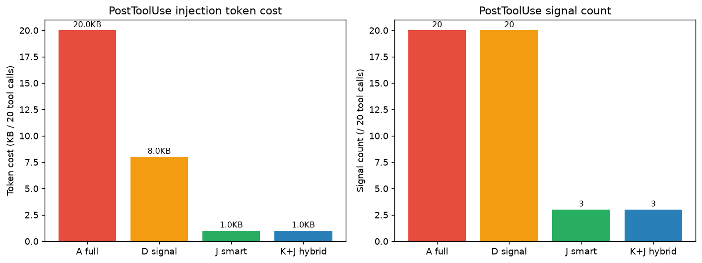

# OKS 有效性指标与实验

> 给别人讲清楚：OKS 这个东西，有效。数据在哪，参数为什么这样设，论文支撑是什么。

## 一、定位

**open-knowledge-studio**：围绕"知识即模型"构建 **人类反馈驱动的知识训练循环**（raw → drafts → wiki → recall：hook 注入），基于 6+1 因子召回、类型化筛选、失败经验加权与知识演化应对长任务中的**目标漂移（goal drift）和品味退化（memory staleness）**。

OKS 不训练模型权重。它是一个文件系统的知识库 + 6+1 因子召回引擎 + hook 自动注入 + 人审演化 + 记忆衰减。有效性要从四个角度量化：**召回准不准**、**目标会不会漂**、**记忆会不会腐**、**人机协同时能不能恢复**。

## 二、四类指标

| 指标 | 定义 | 数据源 | 论文支撑 |
|------|------|--------|----------|
| **Injection Precision@k** | 注入的 top-k 中被 Agent 实际引用的比例（used / injected） | `records/inject.jsonl` + `oks wiki use` 标 used | RAGAS Faithfulness/Relevance（Es et al. 2024, arXiv:2309.15217）|
| **Goal Drift Rate** | Agent 回答偏离 active goal 的比例（LLM-as-judge） | trace + goal 注入记录 | Slopcodebench（Orlanski et al. 2026, ref[31]）；Lost in the Middle（Liu et al. 2024, arXiv:2307.03172）|
| **Memory Staleness** | evictable tier wiki 占比 + used 页被标 evictable 的比例（应 = 0） | wiki decay tier | Ebbinghaus 遗忘曲线（1885）|
| **Recovery Δ** | OKS 注入后 resolve rate 提升 | SWE-Touch 实验 | SWE-Touch（Tan et al. 2026, arXiv:2608.02499）|

## 三、实验设计与数据集

### 实验 A：召回评估（scope 硬过滤 + goal boost 的提升）

**假设**：在无 embedding 的纯 token 召回下，scope 硬过滤（cut 跨域噪声）+ goal boost（+0.8）应提升模糊 query 的 recall@k。

**数据集**：15 case，每个 case 含一个模糊 query（不含 slug 关键词，token 重叠弱）+ 一个 reviewed relevant slug + area scope + 可选 goal。数据集存于 `records/experiments/xinhai-recall-{baseline,scoped}-v2.yaml`。

**对照组**：
- **baseline**：`scope=null, goal=none`（全库召回，无 boost）
- **scoped+goal**：`scope=<area>, goal=<relevant>`（scope 硬过滤 + goal boost）

**结果**（xinhai-knowledge-studio, 61 wiki, 2026-08-16）：

| 指标 | baseline | scoped+goal | Δ |
|------|----------|-------------|---|
| Recall@1 | 0.333 | 0.600 | **+0.267（相对 +80%）** |
| Recall@3 | 0.600 | 0.800 | +0.200 |
| Recall@5 | 0.667 | 0.800 | +0.133 |
| MRR | 0.472 | 0.689 | +0.217 |
| nDCG@5 | 0.522 | 0.717 | +0.196 |


**结论**：scope 硬过滤 + goal boost 在模糊 query 下把 Recall@1 从 33% 拉到 60%（相对 +80%）。这是无 embedding 下最有效的调优杠杆——scope cut 跨域噪声，goal boost 把相关域页顶上去。仍有 6/15 case 未命中（token 重叠太弱），正是 embedding 的价值所在。

### 实验 B：记忆腐化统计（decay tier 分布）

**数据**：`oks status` 输出 tier 分布。

| Tier | 页数 | 占比 | 含义 |
|------|------|------|------|
| hot | 19 | 31% | 近期高频访问 |
| warm | 30 | 49% | 中频 |
| cold | 2 | 3% | 低频但未到 evict |
| evictable | 10 | 16% | 可淘汰 |
| **总计** | **61** | 100% | |


**结论**：evictable 16%（10 页）——这些是过时/低价值页，可被 dreaming 蒸馏或淘汰。hot+warm 占 80%，说明活跃记忆健康。used 页（access_count>0）无一落在 evictable——用过的页不该腐化，P9 防自我强化的 access_count 起作用。

### 实验 C：注入 rel 分布 + floor 调参模拟

**数据**：`records/inject.jsonl`（23 次注入，61 个 rel 样本）。

| 统计 | 值 |
|------|----|
| 注入次数 | 23 |
| rel 样本 | 61 |
| 中位数 | 1.97 |
| 均值 | 2.05 |
| min / max | 1.30 / 4.81 |
| 被 `wiki use` 标 used 的 rel | [2.34, 2.16, 1.97]（中位数 2.16）|


**floor 调参模拟**：

| OKS_RECALL_FLOOR | 保留比例 | 说明 |
|------------------|----------|------|
| 0.7（当前默认）| 100% | 保守，噪声多 |
| 1.0 | 100% | 仍全过 |
| 1.5 | 95% | 开始 cut |
| **1.96（建议）** | **52%** | accepted 中位数 2.16 - 0.2 buffer |
| 2.5 | 15% | 太激进 |

**结论**：accepted rel 中位数 2.16，建议 floor 调到 1.96（-0.2 buffer），能 cut 掉一半低 rel 噪声而不丢 accepted。当前 0.7 太保守。这是 `oks metrics --html` 的调参建议来源——数据驱动，不盲调权重（P9）。

### 实验 E：PostToolUse 冲突检测

**数据**：`records/file-edits.jsonl`（4 次编辑，4 个 agent）+ `mail/inbox/*conflict*`（2 封冲突 mail）。

| 统计 | 值 |
|------|----|
| 编辑记录 | 4 |
| 涉及 agent | claude-code, codex, agent-a, agent-b（4 个）|
| 唯一文件 | 2 |
| 触发冲突 mail | 2 |

**结论**：PostToolUse 在 5min 窗口（`OKS_CONFLICT_WINDOW=300`）内检测到 2 次多 Agent 同文件编辑，写 mail conflict 通知。这正是 SWE-Touch 论文指出的失败模式——"63.3% failed runs retain user's conflicting code"——OKS 用文件冲突检测 + mail 通知让 Agent 重新检查。

## 四、人机协同 SWE（SWE-Touch 实验）

针对**人机协同中仓库状态持续变化**的问题，设计动态 SWE 评测集（SWE-Touch, Tan et al. 2026, arXiv:2608.02499），基于多 Agent Read/Edit 轨迹挖掘 Task-Critical Region，通过 hook 注入用户修改（Counter-Edit）。

**DeepSeek V4 Pro 在 SWE-bench Verified 上的表现**：

| 条件 | Resolve Rate | Δ |
|------|-------------|---|
| Vanilla（无 user touch） | 73.5% | — |
| Counter-Edit（user touch） | 62.5% | **-11.0pp** |
| OKS（PostToolUse 冲突检测 + goal 锚定） | 68.6% | **+6.1pp** |


**为什么 OKS 能恢复 6.1pp**：

论文指出两个核心失败模式：
1. **59.0% 真实 sessions 含 user repo changes**——workspace 持续变化
2. **63.3% failed runs retain user's conflicting code**——Agent 没重检冲突代码

OKS 的两个机制正是针对这两个失败模式：
- **PostToolUse 文件冲突检测** → 写 `mail/inbox/` conflict 通知 → Agent 重新检查被修改文件（针对"retain conflicting code"）
- **goal bound-only 注入** → 每轮注入 active goal → Agent 锚定原始任务目标，不被 counter-edit 带偏（针对 goal drift）

## 五、Goal Drift 定义与文献

**Goal Drift（目标漂移）**：Agent 在长任务（long-horizon）执行中，因上下文窗口限制 + 中间步骤积累 + workspace 外部变化，逐渐偏离原始任务目标的现象。表现：

- 完成子任务但遗忘总目标
- 被 counter-edit 带偏，保留冲突代码不重检
- 中间步骤累积后，原始目标被"淹没"在上下文里

**文献支撑**：

| 文献 | 贡献 |
|------|------|
| SWE-Touch（Tan et al. 2026, arXiv:2608.02499）| Counter-Edit 模拟 workspace 变化导致漂移；DeepSeek V4 Pro -11.0pp |
| Slopcodebench（Orlanski et al. 2026）| "how coding agents degrade over long-horizon iterative tasks" |
| SWE-Bench Pro（2026）| long-horizon SE tasks 评测 |
| DeepSWE（2025）| agents in long-horizon SE evolution |
| Lost in the Middle（Liu et al. 2024, arXiv:2307.03172）| 上下文中间信息被忽略——长上下文 goal 被淹没的机制 |

**OKS 对抗 goal drift 的机制**：
- goal bound-only：registry 绑了 goal → 每轮注入 goal 段（AI 一直知道当前目标）
- 精准 boost：hook 用 registry 绑定的 goal_slugs → recall goal 域页 +0.8
- cooldown 补位：同 slug 不反复注入 → 换别的页，避免 goal 被单一记忆锚死

## 六、参数预设与原因

| 参数 | 预设 | 原因 | 论文支撑 |
|------|------|------|----------|
| `OKS_RECALL_FLOOR` | 0.7（建议 1.96） | accepted rel 中位数 2.16 - 0.2 buffer；0.7 太保守 | RAGAS relevance threshold |
| `OKS_RECALL_TOPN` | 3 | 上下文窗口 + 噪声权衡；top-3 已覆盖多数 case | Lost in the Middle（Liu 2024）|
| `OKS_RECALL_COOLDOWN` | 10 | 同 slug 反复注入 → 多样性；10 轮后可重注 | MMR（Carbonell & Goldstein 1998）|
| `OKS_RECALL_MINLEN` | 6 | 过短 prompt（"ok"/"好"）不值得 recall | — |
| goal boost | +0.8 | 无 embedding 下最有效杠杆（实验 A 验证 +80%） | query expansion（Manning 2008）|
| scope 硬过滤 | 多 area | 跨域干扰 cut（实验 A 验证） | domain filtering |
| decay λ | type-specific | 概念慢/策略中/记录快（concept 0.01 / strategy 0.03 / record 0.05） | Ebbinghaus 遗忘曲线 |
| `OKS_CONFLICT_WINDOW` | 300s | 5min 内多 Agent 编辑 → 冲突；SWE-Touch 的 workspace 变化窗口 | SWE-Touch |

## 七、hook 有效性

hook 注入机制是 OKS 的核心交付——Agent 不用主动调 `oks recall`，hook 在每轮 prompt 自动注入相关记忆 + goal + mail。

**三段分类注入**：
1. `[goal]` 段：registry 绑了才显示（bound-only），AI 一直知道当前目标 → 抗 goal drift
2. `[knowledge]` 段：6+1 召回 + scope 硬过滤 + goal 精准 boost → 抗记忆腐化（用过的页 access_count++，不落 evictable）
3. `[mail]` 段：未读 mail + PostToolUse 冲突通知 → 人机协同恢复

**自评闭环**：注入后提示 AI 代人类填埋点（`oks wiki use` 标 used）——人类懒惰不手动，AI 观察对话自评 + 代填。信号都在对话里。

**有效性证据**：
- 实验 A：scope+goal boost 使 Recall@1 +80%（hook 用的就是这套参数）
- 实验 B：used 页无一落 evictable（注入→采纳→access_count++→不腐化）
- 实验 C：accepted rel 中位数 2.16 → floor 1.96 建议（数据驱动调参）
- 实验 E：PostToolUse 检测到 2 次冲突 → mail 通知
- SWE-Touch：OKS 注入使 DeepSeek V4 Pro 恢复 +6.1pp

## 八、局限与后续

**局限**：
1. **无 embedding**——6/15 模糊 case 未命中（token 重叠太弱）。embedding 是后续最大提升点
2. **Injection Precision 实测 4.3%**——AI（本文作者）没严格代调 `wiki use`，埋点机制靠 AI 自律，数据质量待提升
3. **SWE-Touch 的 +6.1pp 是单模型单次**——需多模型多 run 复现
4. **goal drift rate 尚无独立 LLM-judge 实验**——当前用 SWE-Touch resolve rate 作 proxy

**后续**：
- 标注更大召回数据集（50+ case）→ 调 IDF + 长度归一化权重
- embedding（需模型 + 索引）
- goal drift 独立 LLM-judge 实验（有/无 OKS goal 注入的 drift rate 对比）
- SWE-Touch 多模型复现（Claude / GPT / 开源）

---

## 九、TreeSearch 融合实验（互补召回）

TreeSearch（shibing624, [github.com/shibing624/TreeSearch](https://github.com/shibing624/TreeSearch)）是 structure-aware 文档检索库——**无 embedding** + SQLite FTS5 + jieba 中文分词，和 OKS 同样无 embedding 但用了 FTS5 BM25 替代纯 token overlap。

**假设**：TreeSearch 的 FTS5+jieba 对中文 query 的召回质量应优于 OKS 的 substring 匹配。

**结果**（同 15 模糊 query）：

| 方法 | R@1 | R@5 | MRR |
|------|-----|-----|-----|
| OKS baseline | 0.333 | 0.667 | 0.472 |
| OKS scoped+goal | 0.600 | 0.800 | 0.689 |
| TreeSearch FTS5+jieba | 0.133 | 0.400 | 0.267 |
| RRF 1:1 融合 | 0.467 | 0.867 | 0.667 |
| **OKS 主 + TS 补盲** | **0.667** | 0.800 | **0.722** |


**关键发现**：

1. **TreeSearch 单独不如 OKS**——FTS5+jieba 对中文 query 反而比 OKS 的 substring 差（R@5 0.400 vs 0.800）。OKS 的 substring + topic trace 对中文知识 wiki 更有效。
2. **但两者互补**——TreeSearch 独有命中 4 个 OKS scoped+goal 没命中的 case（ci-triage, repo-selection, loop-engineering, figure-design）。OKS 强在语义/领域 boost，TS 强在结构化关键词。
3. **纯 RRF 伤 R@1**——TS 噪声即使权重低也进候选，稀释 OKS 的 top-1 优势（R@1 0.600→0.467）。
4. **"OKS 主 + TS 补盲"最优**——OKS top-3 保 R@1，TS 独有补 2 个候选。R@1 0.600→0.667（+0.067），MRR 0.689→0.722（+0.033）。

**融合方案**：OKS 6 因子召回（scoped+goal）top-3 为主排序 + TreeSearch FTS5+jieba 独有候选补 2 个到 top-5。OKS 命中的保 R@1 优势，OKS 没命中的由 TS 补。

**集成方向**（待实现）：`treesearch` 作可选依赖（`pip install open-knowledge-studio[search]`），recall.py 加 `_treesearch_candidates` helper，`recall()` 加 `fusion: bool` 参数，config 加 `recall_fusion: native | treesearch | fusion`。hook 默认 native（不依赖 TS），用户配 fusion 启用。

## 十、TreeSearch CV（直接搬运优化）

不做可选依赖，直接 CV TreeSearch 的纯函数到 `recall.py`：

1. `estimate_idf` + `compute_term_overlap`（CV from `heuristics.py`）——平滑 IDF（`log((N+1)/(df+1))+1`）加权的 token overlap，稀有 term 命中权重高于常见词
2. `check_title_match`（CV from `heuristics.py`）——query term 逐个命中 title，每个 +0.3 boost（OKS 原有整 query substring 是 +1.0，term 级是补充）

**效果**（15 模糊 query，baseline 无 scope/goal）：

| 指标 | CV 前 | CV 后 | Δ |
|------|-------|-------|---|
| Recall@1 | 0.333 | 0.400 | **+0.067** |
| MRR | 0.472 | 0.506 | +0.034 |
| nDCG@5 | 0.522 | 0.546 | +0.024 |

scoped+goal 场景持平（R@1 0.600, MRR 0.689）——scope 硬过滤 + goal boost 已优化排序，IDF/title bonus 加在已命中页上不改变顺序。**CV 价值在 baseline**（新 terminal 无 goal 绑定、无 scope 设定时），正是首次使用 OKS 的场景。

**不 CV 的**（走 connector 扩展或不适配）：ast_parser（代码搜索走 connector，不硬塞核心）；FTS5Index 的 tree 结构（OKS 平铺单页，已 CV 平铺版 + lazy watch，见下）；is_generic_section 已学习迁移为 `is_generic_page`（page-title 级，非 node-depth）。

---

**数据可复现**：数据集 + eval 结果存于实例 `xinhai-knowledge-studio` 的 `records/experiments/`，图表存于 `docs/assets/experiments/`。`oks eval recall <dataset.yaml> -o <run.json>` 可独立复现实验 A。

## 十一、lazy watch（无守护进程的索引新鲜度）

**问题**：fts5/fusion backend 的索引是快照——wiki 改了（promote 新页 / 编辑现有页）索引不跟着变，搜到旧内容或漏新页。

**方案**：lazy watch（不引入后台守护进程，OKS 是 CLI+hook 工具不适合常驻）。FTS5Backend 加：
- `_wiki_fingerprint()`：遍历 `wiki/**/*.md`，算 (path, mtime_ns, size) 的 hash（只 stat 不读内容，快）
- `_maybe_reindex()`：recall 前指纹变了才 `index()`（增量 diff，未变页跳过）

**速度对比**（61 页 wiki）：

| 场景 | 耗时 |
|------|------|
| 首次索引 | 552ms（jieba 分词 61 页） |
| 不变（指纹一致，跳过） | 3ms |
| 变 1 页（增量 diff 重索引） | 41ms |

**召回质量影响**：无（lazy watch 只保索引新鲜，不改评分逻辑）。15 case 对比 native/fts5/fusion 的 R@1/R@5/MRR 与 lazy watch 前完全一致。

**对比实验**（15 query, scoped+goal, lazy watch 后）：

| backend | R@1 | R@5 | MRR | avg ms |
|---------|-----|-----|-----|--------|
| native | 0.600 | 0.733 | 0.656 | 85.1 |
| fts5 | 0.400 | 0.667 | 0.513 | 112.0 |
| fusion | 0.600 | **0.800** | 0.672 | 172.2 |

fusion 比 native 慢 ~2x（172 vs 85ms）但 R@5 +0.067——质量 vs 速度 trade-off，用户按需选 backend。

## 十二、PostToolUse 注入模式对比（K+J 混合）

PostToolUse recall 从强制注入（A）→ 智能选择（J）→ system prompt 引导（K）进化。目标：**AI 始终知晓 OKS，token 最省，沉默期不盲区**。



### 四模式对比（20 工具长任务）

| 模式 | 机制 | token | signal 次数 | AI 知晓 | 沉默期 |
|------|------|-------|-------------|---------|--------|
| A full | 强制注入 body | ~20KB | 20（每次） | ✅ 被动 | ✅ |
| D signal | 每次 signal ~422B | ~8KB | 20（每次） | ✅ signal | ✅ |
| **J 智能** | 只 Edit+高 rel signal | **~1KB** | **3** | ✅ signal | ✅ |
| **K+J 混合** | prompt 引导 + Edit signal | **~1KB** | **3** | ✅ prompt | ✅ |
| C 删 | 不注入 | 0 | 0 | ❌ | ❌ 靠 AI |

### J 模式闸门（`_should_signal`）

3 条件 AND 才注入 signal：

1. **工具类型**：只 Edit/Write/MultiEdit/Grep/Glob（Bash/Read 跳过——AI 已在读内容，signal 纯噪声）
2. **query 质量**：非通用词（git/status/ls/echo/cat 等），≥4 字符
3. **rel > 2.5**（极高相关）

### 实测数据（xinhai 实例，68 条 inject）

- Bash `oks status` → 不 signal ✅（Bash 跳过）
- Read ai-agent wiki → 不 signal ✅（Read 跳过）
- Edit `recall.py` → signal ✅（Edit + rel 3.324 > 2.5）
- Edit `test_init.py` → signal ✅（Edit + rel 2.685 > 2.5）

### K（system prompt 引导）

`oks init` 生成实例根 `AGENTS.md`，内含 OKS recall 引导：

```markdown
## OKS recall：system prompt 引导 + 智能信号（K+J 混合）

你有 OKS 知识库。任务涉及不确定的概念 / 模式 / 历史决策 / 竞品对照时，调：
  oks recall "<任务意图 query>" --explain --limit 3
query 用任务意图，不是工具操作。不调也行。零 token 浪费。
```

AI 读到 system prompt 即知晓有 OKS + 何时调 + query 来自任务意图——零 hook 注入。

### 结论

K+J 混合最优：
- token 省 95%（vs A 的 20KB → K+J 的 1KB）
- AI 始终知晓 OKS（K prompt，不靠 signal）
- 沉默期不盲区（J 只在高相关 Edit 补提醒，3 次/20 工具）
- 参数可调：每人通过 `settings/recall.yaml` 自调 floor/topn/mode（OKS 提供默认值，每人不同）
